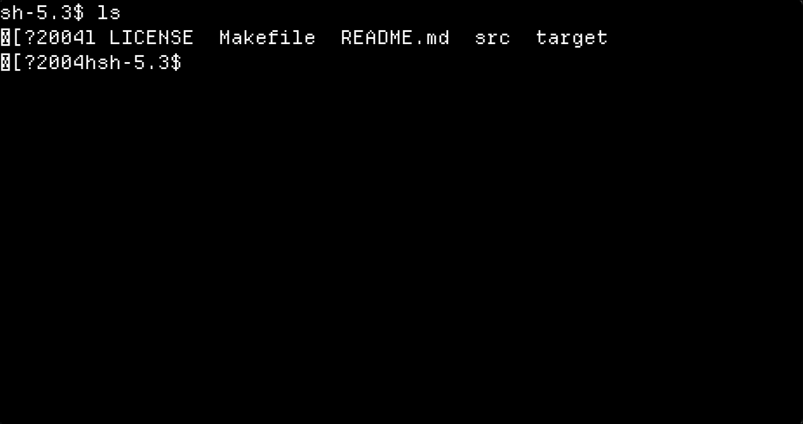

# SLTT - Simple linux toy terminal
My simple hobby project for a very minimal terminal emulator.

## Capabilities
- Programs like ls and cd, etc. work fine
- Simple shells work fine
- Not suited for daily use
- Can't handle most cli apps
- Simples escape sequences break it
- Software rendering
## Build instructions
```bash
make sltt
```
## License
Code: MIT (see LICENSE). 
